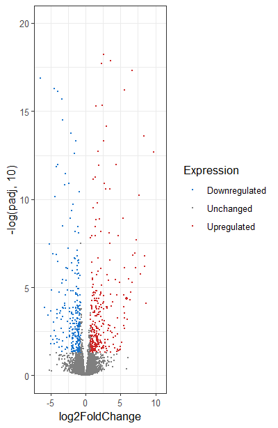

# Role-of-Drosophila-Chromatin-Remodeling-Factor-CHD1-in-regulation-of-dosage-compensation

**Students:**
- Egor Kulikov, 
Head of the Laboratory of Applied Genetics and Molecular Diagnostics, FSC ARRTPI

- Aleksandra Mikhailova, 
Scientific Researcher, Lab of Postgenomic Investigation, VIR

**Supervisor:**

- Aleksandr Konev,
PhD, Senior Researcher, Group of Genetic Studies Chromatin and Reparation,
Petersburg Nuclear Physics Institute named by B.P.Konstantinov of NRC «Kurchatov Institute»


### Introduction

Gene dosage compensation (DC) is an epigenetic mechanism that allows equalization of the expression level of sex-linked genes in males and females of species in which sex is determined by sex chromosomes [1]. In the fruit fly *Drosophila melanogaster*, DC is achieved by doubly increasing the level of expression of genes on the single X chromosome in males. It was reported earlier that X chromosome in the *Chd1* mutant males becomes shortened, decondensed and thickened, while in females it characterizes a normal structure [2]. In this case, the *Chd1* gene product of maternal origin is concentrated in the X chromosome, causing its specific staining. Thus discovered the role of CHD1 in regulating the structure of the X chromosome of males, associated with the phenomenon of DC. The CHD1 protein is considered to be one of the key factors in the replication-independent assembly of chromatin containing variant histone H3.3. In *Drosophila* absence of CHD1 protein in embryos caused misassembly of H3.3 in paternal pronuclear chromatin, while loss of CHD1 in the adult brain resulted in decreased H3.3 incorporation into chromatin, global chromatin disruption, transcriptional dysregulation, and metabolic reprogramming [3].

In this study we aimed on estimation of potential influence of the CHD1 factor on gene expression profiles in *Drosophila*. 

### Aim and Tasks

Study the specific roles of the *Drosophila* CHD1 in dosage compensation

The tasks include:
- Analyze the raw RNA-sequenced data:
  - Perform quality control
  - Align reads on rRNA reference genome sequence with Bowtie2
  - Align reads without rRNA on reference genome with STAR
  - Gene reading counting with FeatureCounts

- Visualize and analyze mapped reads in RStudio: 
  - Find differentially expressed genes (DEGs) using DESeq2
  - Compare different groups: male-female and mutant-control using MA-plots 
  - Reveal statistically overrepresented GO-terms by the GO  enrichment analysis in FlyBase.org database
  - Study the role of CHD1 in dosage compensation in Drosophila

### Data

The head of four-day-old imago of fruit fly *Drosophila melanogaster* in two technical replicates was used for RNA isolation. The wild type is represented by the Oregon R line, while the mutants are characterized by depletion in the *Chd1* gene. Samples are presented in two biological replicates. To prepare the libraries, we used the MGIEasy RNA Directional Library Prep Set kit.ver. 2.1 reagent kit. These libraries were sequenced using an MGI platform.

### Workflow

Our workflow includes following steps:


### Technical notes

#### *Analysis the raw RNA-sequenced data* 


#### *Visualization and analysis of mapped reads in RStudio* 

Packages for the installation:
```r
if (!require("BiocManager", quietly = TRUE))
  install.packages("BiocManager")

BiocManager::install("DESeq2", dependencies = TRUE, force = TRUE)
BiocManager::install("ComplexHeatmap", dependencies = TRUE, force = TRUE)
BiocManager::install("clusterProfiler", dependencies = TRUE, force = TRUE)
library("BiocManager")
library("DESeq2")

if (!require("ggplot2", quietly = TRUE))
  install.packages("ggplot2")

if (!require("ggfortify", quietly = TRUE))
  install.packages("ggfortify")

if (!require("gridExtra", quietly = TRUE))
  install.packages("gridExtra")

if (!require("carData", quietly = TRUE))
  install.packages("carData")

if (!require("car", quietly = TRUE))
  install.packages("car")

if (!require("factoextra", quietly = TRUE))
  install.packages("factoextra")

if (!require("pcaMethods", quietly = TRUE))
  install.packages("pcaMethods")

if (!require("FactoMineR", quietly = TRUE))
  install.packages("FactoMineR")

if (!require("dplyr", quietly = TRUE))
  install.packages("dplyr")

if (!require("RColorBrewer", quietly = TRUE))
  install.packages("RColorBrewer")

if (!require("wordcloud", quietly = TRUE))
  install.packages("wordcloud")

library(ComplexHeatmap)
library(ggbiplot)
library("ggplot2")
library("ggfortify")
library("gridExtra")
library("carData")
library("car")
library("factoextra")
library('pcaMethods')
library(ggplot2)
library(dplyr)
library(clusterProfiler)
library(RColorBrewer)
library(wordcloud)
library(pathview)

```
Downloading the data and providing the quality control

```r
# Read the .txt file after FeatureCounts
simple_counts <- read.table("simple_counts_STAR.txt", 
                            header = TRUE, sep="\t", na.strings = "NA", row.names = 1,
                            dec=".")

# Rename the columns 
colnames(simple_counts)[1] <- "Female_Oregon_1"
colnames(simple_counts)[2] <- "Female_Oregon_2"
colnames(simple_counts)[3] <- "Female_CHD1n_1"
colnames(simple_counts)[4] <- "Female_CHD1n_2"
colnames(simple_counts)[5] <- "Male_Oregon_1"
colnames(simple_counts)[6] <- "Male_Oregon_2"
colnames(simple_counts)[7] <- "Male_CHD1n_1"
colnames(simple_counts)[8] <- "Male_CHD1n_2"

# Evaluate the data quality
# Correlation between samples
correlation <- cor(simple_counts)

# Evaluate the square of Pearson correlation coefficient
cor.sq <- round(correlation**2, 3)
spearman <- cor(simple_counts, method = "spearman")

```


Find differential gene expressed genes using DESeq2 v1.48.0 [6]

```r
# Create table with describtion of experiment design

expr.matrix <- as.matrix(simple_counts)
is.matrix(simple_counts)
is.matrix(expr.matrix)
print(dim(expr.matrix))

# Create the design of experiment 

expr.design <- data.frame(row.names = colnames(simple_counts), condition = c("control", "control", "mutant", "mutant", "control", "control", "mutant", "mutant"))

expr.design <- data.frame(row.names = colnames(expr.matrix), # name of the raws are the name of samples
                          condition = c("control", "control",
                                        "mutant", "mutant",
                                        "control", "control",
                                        "mutant", "mutant"))

# Combine all prepeared data in common  variable

dds <- DESeqDataSetFromMatrix(countData = expr.matrix, colData = expr.design, design = ~ condition) 
dds <- DESeq(dds)
res <- results(dds)
head(res)

# Save obtained results with DEGs as a table in local directory

write.table(as.data.frame(res), "DESeq_Dm.txt", sep = "\t", col.name = T, row.names = T, quote = F, na = "NA")

```
Estimate the dispersion of data and revealed the up- and down-regulated genes

```r

# Normalize data on library size
dds <- estimateSizeFactors(dds)
sizeFactors(dds)

# Obtain normalized readcounts 
normalized.counts <- counts(dds, normalized = T)

# Save in table
write.table(normalized.counts, "Norm_Sac.txt", sep = "\t", col.name = T, row.names = T, quote = F, na = "NA")

# Estimate the dispersion 
plotDispEsts(dds)

# Visualize the results of data analysis
plotMA(dds, ylim = c(-2,2), main = "DESeq2")

# Evaluate statistically significant DEGs (FDR < 0.05)
sum(res$padj < 0.05, na.rm = T)
667

# Select in variable genes with FDR < 0.05
resSig <- subset(res, padj < 0.05)
head(res)
head(resSig)

### Select DEGs
# Divide into different variables genes with FC > 2 and FC < 0.05

resSigUp <- subset(resSig, log2FoldChange > 1)
resSigDown <- subset(resSig, log2FoldChange < -1)

sum(resSig$log2FoldChange > 1, na.rm = T)
249

sum(resSig$log2FoldChange < -1, na.rm = T)
209

# Save results in tables
write.table(as.data.frame(resSigUp), "DESeq2_Up.txt",
            sep = "\t", col.names = TRUE, row.names = TRUE,
            quote = FALSE, na = "NA")

write.table(as.data.frame(resSigDown), "DESeq2_Down.txt",
            sep = "\t", col.names = TRUE, row.names = TRUE,
            quote = FALSE, na = "NA")

```

Visualize data on heatmap and volcano plots

```r
#Heatmap

# Unit in common variable name of rows with DEGs
names <- c(row.names(resSigDown), row.names(resSigUp))

# Select the rows from table normalized.counts, where rows match to rows name in variable names
de.genes <- subset(normalized.counts, row.names(normalized.counts) %in% names)
Heatmap(de.genes, show_row_names = F)

# logarithmize the data to normalize the expression level
log.de.genes <- log10(de.genes)
Heatmap(log.de.genes, show_row_names = F)

# error (since our data contains genes that were not expressed in some samples) - add some number to all readcounts
de.genes <- de.genes +0.01
log.de.genes <- log10(de.genes)
Heatmap(log.de.genes, show_row_names = F)

# Scaled to improve visualization
scaled.row.de.genes <- t(scale(t(log.de.genes)))
Heatmap(scaled.row.de.genes, show_row_names = F)

#Volcano plot 
library(ggplot2)

# Save variable res in table 
de.results <- as.data.frame(res)

# Since the statistically significant values ​​of the adjusted p-value - padj that interest us are too small, we take their logarithm
ggplot(de.results, aes(log2FoldChange, -log(padj, 10))) +
  geom_point(size = 0.4)

library(dplyr)

# Let's reduce the y-axis and show which genes are growing, falling, etc.
de.results <- de.results %>%
  mutate(Expression = case_when(log2FoldChange >= log(2)
                                & padj < 0.05 ~ "Upregulated",
                                log2FoldChange <= -log(2)
                                & padj < 0.05 ~ "Downregulated",
                                T ~ "Unchanged"))


ggplot(de.results, aes(log2FoldChange, -log(padj, 10), color = Expression)) +
  geom_point(size = 0.4) +
  scale_color_manual(values = c("dodgerblue3", "gray50", "firebrick3")) + 
  theme_bw() +
  ylim(0, 20)

```

Gene ontology for *Drosophila*

```r
####Prepare Input

# reading in input from deseq2
df = read.csv("drosphila_example_de.csv", header=TRUE)

deseq_dm <- read.table("DESeq_Dm.txt", 
                         header = TRUE, sep="\t", na.strings = "NA", row.names = 1,
                         dec=".")

# we want the log2 fold change 
original_gene_list <- deseq_dm$log2FoldChange

# name the vector
names(original_gene_list) <- deseq_dm$X

# omit any NA values 
gene_list<-na.omit(original_gene_list)

# sort the list in decreasing order (required for clusterProfiler)
gene_list = sort(gene_list, decreasing = TRUE)

# Exctract significant results (padj < 0.05)
sig_genes_df = subset(deseq_dm, padj < 0.05)

# From significant results, we want to filter on log2fold change
genes <- sig_genes_df$log2FoldChange

# Name the vector
names(genes) <- sig_genes_df$X

# omit NA values
genes <- na.omit(genes)

# filter on min log2fold change (log2FoldChange > 2)
genes <- names(genes)[abs(genes) > 2]

####Create enrichGO object

#Check which options are available with the keytypes command, for example 

keytypes(org.Dm.eg.db)

####Create the object

go_enrich <- enrichGO(gene = genes,
                      universe = names(gene_list),
                      OrgDb = organism, 
                      keyType = 'ALIAS',
                      readable = T,
                      ont = "BP",
                      pvalueCutoff = 0.05, 
                      qvalueCutoff = 0.10)

###Barplot

barplot(go_enrich, 
        drop = TRUE, 
        showCategory = 10, 
        title = "GO Biological Pathways",
        font.size = 8)


###Dotplot

dotplot(go_enrich)
```


### Results and Discussion

At the beginning of the data quality control we used the FastQC program v0.12.1, which is executed for each file separately and provides for each of the files a report in html-format on the various parameters of the reading quality [4]. 

Mean quality scores, adapter content, N content per base:


GC-content per sequence:


For more detailed infromation conserning FastQC report, please, click on the following links: 
- [Before trimming](file:///C:/Users/mikha/Desktop/BI/Additional_project/FastQC_report/V350198475_unit_97_1_fastqc%20(1).html)
- [After trimming](file:///C:/Users/mikha/Desktop/BI/Additional_project/FastQC_report/trimmed_V350198475_unit_97_1_fastqc.html)

To facilitate the joint analysis we combined the FASTQC reports with the MultiQC program v1.29 [5].
[MultiQC report](file:///C:/Users/mikha/Desktop/BI/Additional_project/FastQC_report/multiqc_report%20(2).html) after trimming 


Correlation analysis data and Pearson correlation results (table 1 and 2, respectively):


We obtained the highest values of correlation coefficients inside groups males, females, mutant and control that indicates on acceptable data quality for further analysis

Before DGE analysis we estimated dispersion for every gene in comparison with its average level of expression. It is important for detection of outliers among genes with extremely high or low expression, as well as for the better understanding of data structure and its variability:


In addition to this, we visualized the logarithmic data on heatmap, where we noticed a clear separation of two groups of genes into clusters with high and low expression for the studied genotypes: control and mutant in females and males:


Statistically significant DEGs were visually assessed from the Volcano plot. Similarly to the heatmap, two groups of genes with high and low expression were identified, as well as those whose expression does not change significantly:



The DEGs with `FDR < 0.05` amounted in overall 667, among them 249 were upregulated (`log2FoldChange > 1`) and 209 downregulated (`log2FoldChange < -1`). 

Additionally we conducted a functional analysis of statistically overrepresented GO terms by the GO enrichment analysis to associate a set of genes with a phenotype:


In case the comparison group of mutant individuals for both sexes we revealed genes associated with dosage compensation by hyperactivation of X chromosome, sex chromosome dosage compensation, epigenetic regulation of gene expression, chromatin remodeling and chromatin organization.


### Conclusions

These results suggest a possible role of CHD1 in the maintenance of dose compensation in *Drosophila melanogaster* males. The downward shift of X chromosome gene expression in males while it is absent in females may indicate a gender-specific function of *CHD1*, presumably related to chromatin-remodeling mechanisms. Given that only housekeeping genes known for their stable expression were included in the analysis, we can conclude that the shifts detected are reliable and not related to the overall variation in expression.

We also observe differences in differential expression between mutant male and female samples for genes unrelated to dose compensation, which may provide a basis for further investigation of *CHD1* function.


### References

1. Shevelyov YY, Ulianov SV, Gelfand MS, Belyakin SN, Razin SV. Dosage Compensation in Drosophila: Its Canonical and Non-Canonical Mechanisms. Int J Mol Sci. 2022 Sep 19;23(18):10976. doi: 10.3390/ijms231810976. PMID: 36142884; PMCID: PMC9506574.
2. Konev A.Y., Tiutiunnik A.A., Baranovskaya I.L. The influence of the Chd1 chromatin assembly and remodeling factor mutations on Dro-sophila polytene chromosome organization. Citologija. 2016;58(4):281-284. (in Russian)
3. Schoberleitner I, Bauer I, Huang A, Andreyeva EN, Sebald J, Pascher K, Rieder D, Brunner M, Podhraski V, Oemer G, Cázarez-García D, Rieder L, Keller MA, Winkler R, Fyodorov DV, Lusser A. CHD1 controls H3.3 incorporation in adult brain chromatin to maintain metabolic homeostasis and normal lifespan. Cell Rep. 2021 Oct 5;37(1):109769. doi: 10.1016/j.celrep.2021.109769
4. Babraham bioinformatics - FastQC A quality control tool for high throughput sequence. https://www.bioinformatics.babraham.ac.uk/projects/fastqc/
5. Ewels, P. MultiQC: summarize analysis results for multiple tools and samples in a single report / P. Ewels et al. // Bioinformatics. – 2016. – V. 19, Nb. 32. – pp. 3047–3048
6. Tong, Y. The comparison of limma and DESeq2 in gene analysis / Y. Tong et al. // E3S web of conferences. – 2021. – V. 271. – P. 03058.


